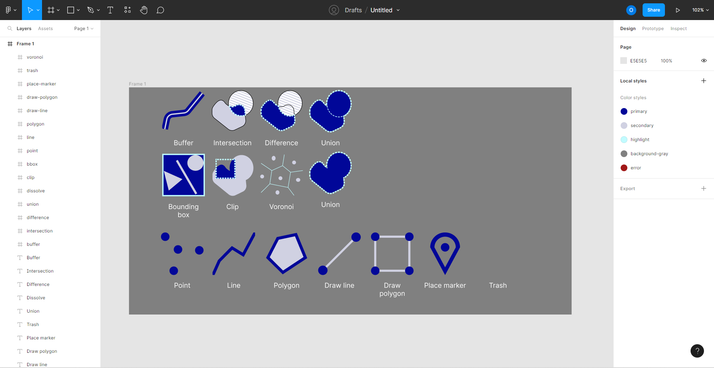

# GGisEZ - TBA4251 (V2023)

## Forfatter: Oskar Holm

### Fakultet for ingeniørvitenskap - IV - NTNU (Geomatikk)

<https://oskarhlm.github.io/GGisEZ/>

## 1 Formålet med applikasjonen

Formålet med applikasjonen er å introdusere arbeidsgangen i et typisk geografisk informasjonssystem (GIS) på en enklest mulig måte. Det er derfor applikasjonen har fått det noe kryptiske navnet "GGisEZ" - en kombinasjon av forkortelsen "ggez" (good game - easy) fra spillverden og forkortelsen GIS. Navnet har det formål å hentyde til at GIS ikke trenger å være vanskelig - at GIS kan være "ez". Framtiden vil vise om intensjonen med navnet i det hele tatt kommer fram hos den gjennomsnittlige brukeren av applikasjonen.

Det viktigste fokusområdet under utviklingsprosessen var brukervennlighet. Ettersom applikasjonen er myntet på personer med lite erfaring med GIS, gikk en betydelig porsjon av arbeidet med til å sjekke bruker-input så godt det lar seg gjøre under de gitte tidsrammene. Derfor har hvert av de ulike GIS-verktøyene en egen valideringsfunksjon som sjekker om de kartlagene brukeren ønsker å utføre transformasjonen gir mening for det valgte verktøyet. Eksempelvis skal det være umulig å "intersection" på et kartlag bestående av linje-geometrier og punkt-geometrier, da dette er en transformasjon myntet på polygon-geometrier. Ønsket om brukervennlighet reflekteres også i valget av programmingsspråk og i brukergrensesnittet.

## 2 Bakgrunn for valg av programmeringsspråk

### 2.1 TypeScript

Programmingsspråket jeg valgte å bruke for dette prosjektet, er TypeScript. TypeScript er et superset av JavaScript som innfører et typesystem til det ellers dynamiske språket. TypeScript er først og fremst ment som et verktøy for utvikleren, og transpileres til JavaScript før det sendes til nettleseren. Fordelen med å bruke TypeScript er at du varsles når du er i ferd med å gjøre uriktige ting, slik som å sende ugyldig input til en funksjon. Det gjør utvikler i stand til å oppdage feil i "compile time", framfor i "runtime", slik man måtte gjort dersom man brukte JavaScript. Dette kan spare deg masse tid som ellers hadde vært brukt på feilsøking og brannslukking. TypeScript gjør også at du lett kan finne ut av hvilke funksjoner om finnes på et gitt objekt, uten å måtte lete deg fram til filen hvor klassen for det objektet er definert.

TypeScript kan være nyttig når man jobber med GeoJSON. Jeg har laget en rekke funksjoner som sjekker om et gitt objekt er gyldig GeoJSON og om det er en Feature, FeatureCollection, GeometryCollection, Point, LineString, MultiPolygon, osv. Disse funksjonene fungerer som "type guards":

```typescript
function foo(data: GeoJSON) {
    if (isFeatureCollection(data)) {
        // Vi vet nå at "data" er en FeatureCollection og har nå tilgang til
        // "features"-attributten som enhver FeatureCollection er pålagt å ha
        ...
    }
}
```

"Type guards" hjelper utvikleren med å skrive trygg kode hvor man unngår å bruke attributter og funksjoner som ikke er definert på objektet man jobber med.

### 2.2 SvelteKit

For å gjøre utviklingsprosessen enklere, har jeg valgt å benytte meg av et app-rammeverk ved navn SvelteKit. SvelteKit er bygget på komponent-rammeverket Svelte, som er et relativt nytt og veldig populært valg for de som ønsker å bygge nettsider. Svelte/SvelteKit kjennetegnes ved å være raskt i produksjon og enkelt å bygge apper med. Sistnevnte er hovedgrunnen til at jeg valgte nettopp dette rammeverket, da noe som ReactJS ofte gjør at man må skrive det som virker som unødvendige mengder "boilerplate"-kode. Jeg ville også bare prøve noe nytt, og SvelteKit virket som et godt valg, ettersom det virkelig er i vinden i frontend-verden.

SvelteKit tilbyr en masse funksjonalitet som skal gjøre det enklere å lage en produksjonsklar applikasjon, sammenlignet med det du får med en vanlig Svelte-applikasjon. Det tilbys ting som en innebygd router, server-side rendering (SSR), adaptere til produksjon i ulike produksjonsmiljøer, og mye mer. Jeg endte ikke opp med å benytte meg av noen av disse funksjonene i særlig stor grad, da jeg ikke følte at de var passende til formålet. Mye av det som gjør SvelteKit bra, er at man kan produsere websidene på serveren og sende ferdige sider til klienten. Dette fungerer heller dårlig ettersom Mapbox ikke støtter dette, og da blir egentlig litt av poenget med å bruke SvelteKit borte, særlig når man ikke heller får bruk for routing-systemet fordi man kun har én side. Sånn sett hadde jeg kommet unna med å "kun" lage en valig Svelte-app, men det er heller ingenting i veien for å bruke SvelteKit uten å ta i bruk hver eneste funksjon som tilbys.

## 3 Oppsummering av arbeidsgangen

### 3.1 MVP og Figma

Det første jeg satt i gang med var å implementere de tingene som er helt nødvendige i et "Minimum viable product" (MVP) for dette formålet. Absolutt nødvendig er det å kunne laste inne et kart og å kunne legge inn kartlag i dette. Det første jeg gjorde var å sette opp kartet med et overlay jeg kunne legge andre komponenter inni. Jeg lagde også noen ikoner til de ulike geoprosesseringsverktøyene ved hjelp av Figma:



### 3.2 Innlasting av filer

Deretter begynte jeg jobben med å kunne legge til geodata i kartet. Dette innebar å lage en fil ved navn `fileUploader.ts` som tar inn en liste med `File`-objekter, leser filendelsen og legger geodataene inn i kartet. Dette var ganske enkelt å få til for GeoJSON-filer, da dette er formatet Mapbox allerede bruker for kartlagene sine. Det var derimot mer utfordrende å få ting til å fungere for shape-filer, spesielt ettersom jeg også hadde lyst til at man skulle kunne lese hvilken projeksjon shape-filen er i fra tilhørende .prj-fil, og deretter konvertere dataene til riktig projeksjon (WGS84) før det legges inn i Mapbox-kartet. Jeg ville også at .dbf-filer skulle kunne leses slik at man får lagt inn `Feature`'s med deres tilhørende `properties`.

Jeg løste problemet ved hjelp av JavaScript-bibliotekene _shapefile_ og _proj4_. _shapefile_ brukes til å konvertere .shp-filer til GeoJSON, mens _proj4_ lar deg konvertere mellom ulike projeksjoner. Dette ser slik ut i koden:

```typescript
const converter = prj && (await readPrj(prj));
converter &&
	geojsonData.features.forEach((f) => {
		f.geometry = convertGeometry(f.geometry, converter);
	});
```

`convertGeometry` er funksjon jeg laget som tar inn et `Geometry`-objekt, sjekker typen på denne, og returnerer et objekt med lik struktur, men der alle geometrier er konvertert ved hjelp av et `proj4.Converter`-objekt.

Jeg laget også en funksjon som tar inn et EPSG-nummer og returnerer en proj4-streng som kan brukes til å lage en `Converter`. Denne brukes i `readPrj`-funksjonen og når brukeren velger å laste ned et kartlag i en spesiell projeksjon. Funksjonen utnytter at man på <https://epsg.io> kan søke opp ethvert EPSG-nummer og få tilbake en streng som _proj4_ kan lese.

```typescript
export async function getProj4String(epsg: string) {
	try {
		const res = await fetch(`https://epsg.io/${epsg}.proj4js`);
		const str = await res.text();
		const proj4StringRegex = /"([^"]+)"/g;
		const match = str.match(proj4StringRegex);
		if (match && match.length > 1) {
			const proj4String = match[1].replace(/"/g, '');
			return proj4String.trim();
		}
	} catch (e) {
		console.error('Failed to extract Proj4 string', e);
	}
}
```

Jeg laget også en funksjon for å lese `properties` fra .dbf-filer. Funksjonen ser slik ut:

```typescript
async function readDbf(file: File) {
	const arrayBuffer = await file.arrayBuffer();
	const dbf = await openDbf(arrayBuffer);

	async function readUntilDone(
		propertiesArray: GeoJsonProperties[] = []
	): Promise<GeoJsonProperties[]> {
		const properties = await dbf.read();
		if (!properties.done) {
			return await readUntilDone([...propertiesArray, properties.value]);
		}

		return propertiesArray;
	}

	return await readUntilDone();
}
```

Når et `GeoJSON`-objekt er ferdig innlest, blir det larget som et MapSource-objekt som brukes når man skal legge et inn i kartet. I `$lib/components/Map/utils.ts` ligger den en fil `addLayerWithTypeCheck` som tar inn blant annet en `MapSource` og legger det inn i kartet som et punkt,- linje- eller polygonlag, basert på hva slags type GeoJSON-objekt som ligger i `MapSource`'en:

```typescript
export function addLayerWithTypeCheck(
	map: mapboxgl.Map,
	source: MapSource,
	options?: LayerOptions<mapboxgl.AnyLayer>
) {
	const data = source.geojson.data;
	if (!isValid(data)) {
		throw new Error('Invalid data source');
	}

	switch (data.type) {
		case 'Point':
		case 'MultiPoint':
			addPointLayer(map, data, source.id, options);
			break;
		case 'LineString':
		case 'MultiLineString':
			addLineLayer(map, data, source.id, options);
			break;
		case 'Polygon':
		case 'MultiPolygon':
			addPolygonLayer(map, data, source.id, options);
			break;
		case 'Feature':
			addFeature(map, source, options);
			break;
		case 'GeometryCollection':
			addGeometryCollection(map, source, options);
			break;
		case 'FeatureCollection':
			addFeatureCollectionLayer(map, source, options);
			break;
	}
}
```

### 3.3 Rekkefølge og synlighet til kartlag

Når det ble mulig å laste inn nye kartlag på en god måte, var det på tide å gjøre det mulig å legge dem oppå hverandre i ønsket rekkefølge, i tillegg til å kunne skjule/slette dem.

### 3.4 Implementasjon av GIS-verktøy

Denne delen av jobben var den klart største, og tok lenger tid enn forventet. Jeg endte opp med å implementere sju verktøy: buffer, bounding box (finner bounding box til en kolleksjon av kartlag), bounding box clip (lar bruker tegn en bbox og returnerer et utklipp av valgt(e) kartlag innenfor denne), difference, dissolve, intersect, union og Voronoi. Jeg tok hjelp fra Turf.js for å gjøre selv transformasjonene. Se avsnittet om programstruktur for å få innblikk i implementasjonen.

## 4 Programstruktur

```
src
│
└───lib
|   └───components
|   │   └───AnalysisTools
|   │       │   AnalysisElement.svelte
|   │       │   ToolsDropdown.svelte
|   |   └───GeoJsonProcessing
|   │       │   bbox.ts
|   │       │   bboxClip.ts
|   │       │   buffer.ts
|   |       |   ...
|   |   |   ...
|   |   └───Map
|   |       |   ...
|   |   └───Sidebar
|   |       └───ToolOptions
|   |       |   ListItem.svelte
|   |       |   Sidebar.svelte
|   |   |   ...
|   └───scss
|       |   ...
|   └───utils
|       fileUploader.ts
|       geojson.ts
└───routes
|   │   _global.scss
|   │   +page.svelte
|   │   ...
└───routes
|   |   mapLayers.ts
|   |   mapSources.ts
└───theme
|   |   ...
|   |   _smui-theme.scss_
|   ...
|   app.html
└───static
|   |   ...
|   |   smui.css
|

```

Over er den overornede strukturen til programmet, hvor mindre viktige filer er ekskludert. `app.html` er "startpunktet" til applikasjonen, og den linker videre til Svelte-delen av applikasjonen. I `routes/`-mappen finner man alle endepunktene, og fil- og mappestrukturen her bestemmer URL-ene til de ulike sidene i applikasjonen. Her har vi kun én `+page.svelte` - altså har vi kun én side i denne applikasjonen.

SvelteKit gir deg også en `lib/`-mappe der du kan legge inn alt fra enkeltkomponenter til CSS-filer. Det er anbefalt å ha mest mulig kode her, slik at ikke filene i `routes`-mappen blir for store, da disse bør fokusere på den overordnede strukturen til applikasjonen, og ikke implementasjon.

I `lib/`-mappen har jeg mapper for hvert av de tre panelene i applikasjonen (`AnalysisTools`, `LayerInfo` og `Sidebar`), samt en egen for selve `Map`-komponenten. `Map`-komponenten importer disse tre hovedkomponentene og plasserer dem i et overlay som lever oppå kartet. `Map`-komponenten importeres deretter til `+page.svelte`, slik at den vises når man navigerer til hjemmesiden (<https://oskarhlm.github.io/GGisEZ/>).

Videre har jeg en mappe kalt `GeoJsonProcessing/`. Her har jeg filer som `buffer.ts`, `intersect.ts` og `difference.ts`. Disse filene eksporterer et objekt bestående av en _processor_ og en _validator_. Her er et eksempel fra `bboxClip.ts`:

```typescript
export default {
	processor: bboxClipProcessor,
	validator: bboxClipInputValidator
} satisfies GeoJSONProcessor<
	MapLayer<mapboxgl.Layer>[],
	GeoJSON[],
	BBoxClipOptions,
	BBoxClipOptions
>;
```

Prosessoren tar inn en liste med `MapLayer`s og returnerer en liste med `GeoJSON`-objekter. De to `BBoxClipOptions`-ene definerer formen på `options`-objektene som sendes til henholdsvis _processor_'en og _validator_'en. Alle filene i denne mappen returnerer objekter av denne typen, noe som gjør at man ikke trenger å hardkode funksjonalitet når man skal bruke verktøyene i .svelte-filene.

Flere av verktøyene har komplementære .svelte-komponenter med navn som `BboxClipOptions.svelte` og `BufferOptions.svelte`. Dette er komponenter som settes inn over listen over kartlag i `Sidebar`'en, og er ansvarlige for at man skal kunne sende `options` til filene som ble diskutert i forrige avsnitt. Disse filene ligger under `Sidebar/ToolOptions/`.

Avslutningsvis vil jeg diskutere de ulike stedene man finner .scss-filer. SCSS er en preprosessor for CSS som skal gjøre CSS enklere å skrive ved hjelp av "nesting", mixin's, osv. Filer som definerer mixin's (CSS-funksjoner) og variabler (fargepalett) ligger i `lib/scss/`. I tillegg har jeg en fil `_smui-theme.scss` som kompileres til `smui.css`. Denne bestemmer stylingen til alle Material UI komponenter som brukes applikasjonen. Dette sammenfatter alle knapper, sliders, osv.

## 5 Tutorial

Se eget tutorial-dokument.

## 6 Diskusjon

### 6.1 Problem underveis

#### 6.1.1 TypeScript - a blessing and a curse

Selv om TypeScript kan gjøre programmet ditt både enklere å utvikle, mer forutsigbart og gi det større grad av korrekthet, kan det også by på utfordringer man ikke får ved bruk av et dynamisk programmeringsspråk. Det var utfordrende å ta hensyn til alle ulike former for GeoJSON som brukeren kan legge inn i kartet. Det kan være en form for Geometry (Point, LineString, Polygon, Multi"x", GeometryCollection) og Feature's, FeatureCollection's. Det er spesielt viktig å vite hva slags geometrier et gitt kartlag består av når man skal utføre transformasjoner på dem. Funksjonene i TurfJS - JavaScript-biblioteket jeg har brukt for å utføre disse transformasjonene - er avhengige av at man gir dem data på riktig format. Noen funksjoner ønsker kun Geometry- og Feature-objekter, og tillatter ikke at du gir dem GeometryCollection's og FeatureCollection's. Selv om dette ikke alltid støttes direkte, er det ønskelig at man skal kunne utføre transformasjonene på geojson-typer som ikke egentlig støttes. Derfor ble det en del knoting for å få alle transformasjonen til å fungere for alle relevante datatyper, noe som tok lenger tid, og var litt vanskeligere, enn forventet.

#### 6.1.2 Svelte Material UI

Det var også en del problemer med å få Svelte Material UI (SMUI) til å fungere bra både i dev-modus og i produksjons-modus. Dokumentasjonen til biblioteket er ikke helt konsekvent, og jeg tror også at den gir feil anbefalinger for hvordan man skal bygge applikasjonen med SMUI. Dermed ble det en del prøving og feiling, men jeg kom til slutt frem til en halvveis god løsning på problemet. Dette var dog et problem jeg gjerne skulle vært foruten, da det absolutt ikke er noe som burde ha bydd på så store utfordringer som det gjorde. Det endte opp med å bli en tidstyv som tok fra meg tid til å implementere funksjonalitet som faktisk er viktig for applikasjonen.

### 6.2 Mangler og feil

Jeg rakk aldri å gjøre alle _validator_'ene til de ulike verktøyene like fullstendige, så det er noen verktøy der det ser ut som at det skal fungere å trykke _Apply_, og så skjer det ingenting og du får ikke noe nytt kartlag. Her er det heller ingen feilmelding for brukeren å se. Jeg har så vidt begynt med å lage et "Snackbar"-system som skal gi brukeren en liten melding på bunn av skjermen for å si at noe har gått feil, men jeg rakk ikke å implementere det skikkelig før fristen. Det er definitivt noe jeg kommer til å fikse når jeg får tid til det.

Ellers har jeg ikke fått brukertestet applikasjonen så nøye som jeg skulle ønske, så det er godt mulig at jeg har glemt noen "edge cases" som gjør at enkelte geometrier får applikasjonen til å gå opp i røyk. Jeg har i stedet lagt inn en link til "issues"-siden på github-siden til applikasjonen, slik at brukere av applikasjonen kan si ifra dersom de støter på noen åpenbare feil.

### 6.3 Brukergrensesnitt

Som nevnt i innledningen, var brukervennlighet hovedfokuset i utviklingsprosessen. I tillegg til validering av bruker-input, er også brukergrensesnitt helt avgjørende her. Under utformingen av brukergrensesnittet har jeg fokusert på at det skal være færrest mulig trykk mellom et ønske om å utføre en analyse til analysen er utført og et nytt kartlag er opprettet. Det bør også være flere intuitive måter å utføre samme funksjon på, slik at hver bruker kan bruke applikasjonen på den måten han eller hun vil.

#### 6.3.1 Lagoversikt

Ytterst til venstre i applikasjonen finner man et panel med oversikt over alle kartlag som ligger inne i kartet. Plassingen av denne samsvarer med den man finner i de fleste populære GIS-applikasjoner (se ArcGIS, QGIS, etc.). I listen over kartlag kan man dra enkeltlag opp og ned og sortere lagene slik man vil. Kartlagene øverst i listen vises foran kartlag lenger ned i listen, slik man forventer. Hvert listeelement har også knapper for å endre synlighet og sletting, samt et ikon helt til venstre for å vise om kartlaget består av punkter, linjer eller polygon.

Lagoversikten i sin "default"-modus er ment for å håndtere alt av synligheten til kartlagene, og ingenting mer. Det er ønskelig å styre synlighet og sletting av et enkelt kartlag ved kun ett trykk, heller enn at man eksempelvis må høyreklikke og skumlese seg nedover en liste av operasjoner helt til man finner "Delete layer". I en mer avansert applikasjon er dette helt klart den beste løsningen, men for en applikasjon med fokus på brukervennlighet mener jeg at det er bedre å ha disse knappene på øverste synlighetsnivå. Jeg ønkset også å unngå så mange "popup"-bokser og "modals" som mulig, alt for å gjøre applikasjonen enklere og mer oversiktlig.

#### 6.3.2 Toolbar

Til høyre for lagoversikten finner man en kolonne med oversikt over tilgjengelige GIS-verktøy. Kun ett verktøy kan velges av gangen og når et verktøy er valgt kan man bruke lagoversikten til å velge hvilke(t) lag man ønsker å utføre en transformasjon på. "Checkboxes" og en uthevingsfarge brukes for å tydelig vise hvilke lag som er valgt. Ved å gjenbruke lagoversikten til å velge kartlag unngår man å måtte ha et eget vindu når man skal utføre en transformasjon, noe jeg mener forbedre brukervennligheten. Når man har valgt lag som er gyldige for den valgte transformasjonen, får man muligheten til å trykke på "Apply"-knappen som nå har blitt blå og trykkbar.

Hvis jeg skal være litt selvkritisk her, vil jeg si at ikonene for å illustrere funksjonaliteten til de ulike ikonene kan være litt vanskelige å tyde. Det er en kunst å gjøre små ikoner beskrivende nok, og det er mulig at jeg burde ha valgt enklere (mer rektangulære) former. Ikonene for "union" og "dissolve" kunne kanskje til fordel være mer ulike, samtidig som det må påpekes at dette er nært beslektede transformasjoner. Mens ikonene kanskje kunne være mer beskrivende, synes jeg likevel at de tar seg godt ut rent estetisk, og liker at de matcher med farge-paletten som er valgt for applikasjonen som en helhet.

#### 6.3.3 Styling og informasjon om kartlaget

Hvis man trykker på et listeelement/kartlag i lagoversikten dukker det opp et panel til høyre der man får muligheten til å endre navn og farge på det valgte kartlaget. Det nåværende navnet og fargen vil være startverdiene når man åpner dette panelet. Dette panelet er kun synlig dersom man faktisk trykker på et kartlag, og er ikke der når man først starter applikasjonen. Dermed unngår man "information overload", noe som er vanlig å få når man åpner et GIS-program for første gang. For å forbedre brukervennligheten har jeg prøvd å ha minimalt med funksjonalitet synlig ved start, slik at brukeren tvinges til å fokusere på det som er viktig, først. Styling-panelt kan lukkes ved å trykke på kartlaget på nytt.

Over styling-panelet finner man en "tab" hvor det står "INFO". Her finner man enkel informasjon om kartlaget, i tillegg til muligheten for å åpne et "attribute table", dersom kartlaget har noe å vise her. Jeg synes det er lurt å sample all lag-spesifikk funksjonalitet på samme sted, så det er derfor jeg har "Styling" og "Info" i samme panel, separert med "tabs".

### 6.4 Potensielle forbedringer

- SOSI: jeg prøvde å bruke Atle Sveen sitt SOSI->GeoJSON-program for å støtte SOSI direkte i applikasjonen, men hadde problemer med implementasjonen. Dette hadde vært artig å få til å fungere.
- Mulighet for å spesifisere koordinatsystem: hvis ikke kartlaget du laster opp er i WGS84, eller har en .prj-fil, vil ikke laget vises riktig. Dette kunne vært fikset ved at man kan spesifisere hvilken projeksjon laget opprinnelig var i, og at programmet deretter gjør en transformasjon.
- Støtte for WMS, raster, etc.
- Mulighet til å "highlighte" enkelt-features i en feature collection.

## Referanser

Jeg har brukt Turf.js til geo-prosessering, proj4 for å transformere mellom ulike kartprojeksjoner og Mapbox for å vise alle geodata. Svelte har gjort det enklere å lage modulære applikasjoner. I tillegg vil jeg gi en "shout-out" til Kari Meling Johannesen og hennes "gis-app", som har fungert som inspirasjon i designprosessen.
