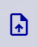
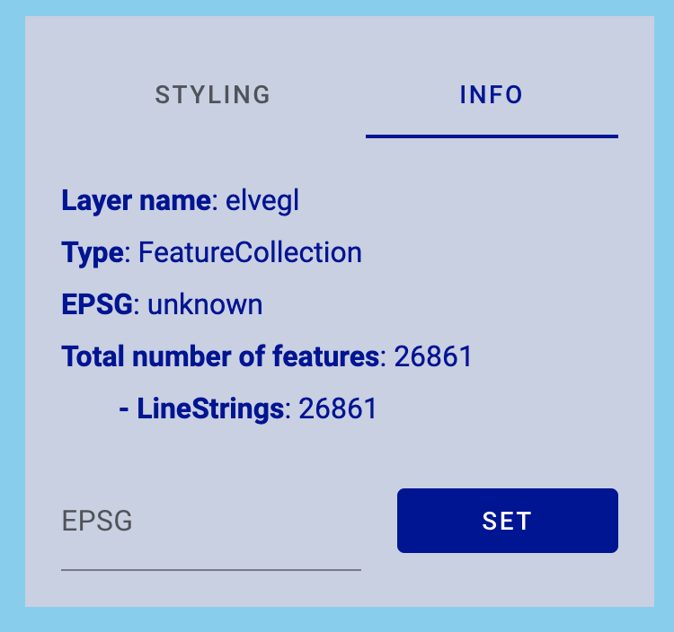
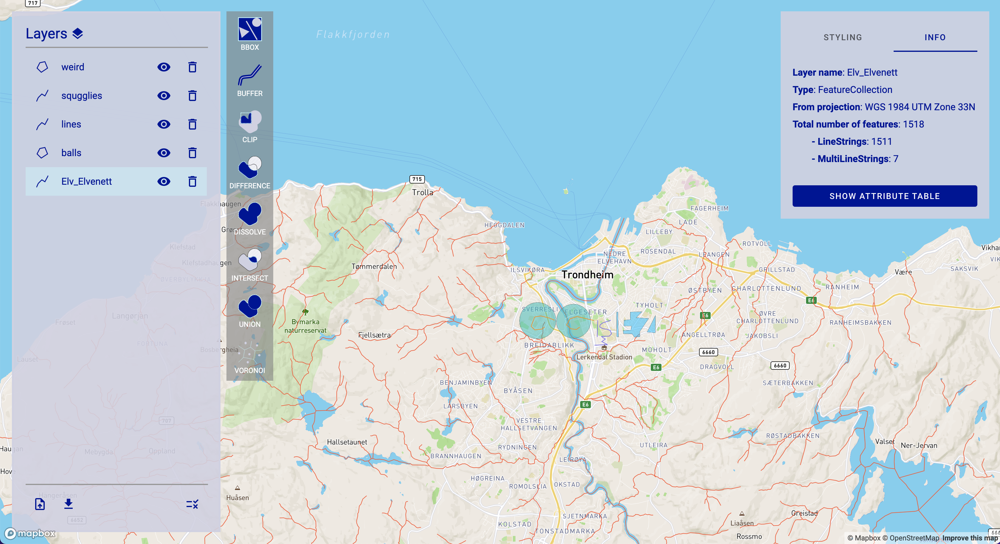
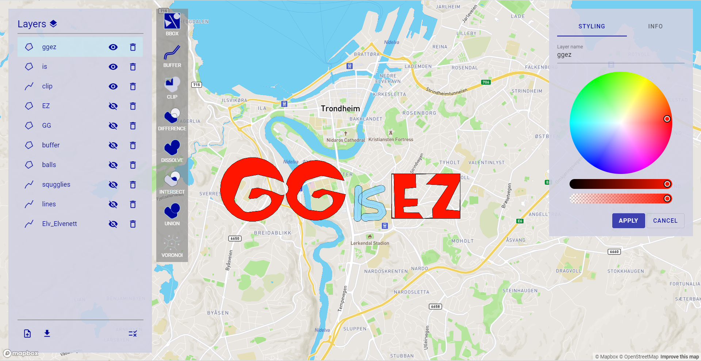

# GGisEZ - Tutorial

GGisEZ is a simple GIS application that lets the user upload geographical data in the form of GeoJSON and shapefiles, and perform various transformations on said data. Follow this tutorial to perform common GIS tasks, using GGisEZ (<https://oskarhlm.github.io/GGisEZ/>).

## Task 1: Upload and explore data layers

### 1.1 Uploading with .prj

Download necessary GeoJSON/shape-files from <https://github.com/oskarhlm/GGisEZ/blob/main/data.zip>. You can then use the -button to upload a data layer. The _Elv_Elvnett_ data layer is a good place to start. Make sure to include all it's files (.shp, dbf, .prj, .shx). The .shp file holds the geometries, whereas the .dbf file includes properties for each feature of the layer, and the .prj file includes information about which projection the data is in. The .prj is especially important, as the source data is in ETRS89 / UTM zone 33N but the Mapbox map is in the GPS projection WGS84. The .prj file enables the program to perform a transformation to WGS84 before the data layer is added to the map.

When loaded, highlight the layer in the panel to the left. You will now see a panel to the right where you can change the name and color of the layer. Press the _Apply_ button for changes to take effect. Select the _Info_ tab in the same panel. Here you have basic info about the layer, and you can also inspect the attribute table of the layer.

### 1.2 Uploading without .prj

If a .prj file is not included, you can specify the original projection of the data layer after said layer has been added to the map. From the provided data, add _elvegl.shp_. You should see the new layer come up in the list of layers, but no geometries are visible in the map. This is because the data is in ETRS89 / UTM zone 33N, whereas the map is in WGS84. We need to tell the application what reference system the data comes from.

Go to the _Info_ tab of the _elvegl_ layer. Here we can specify the EPSG of the new layer.

The EPSG code of ETRS89 / UTM zone 33N is _25833_. Enter this code and press _Set_. The road network of Trondheim should now become visible. You can delete or hide this layer now, as it get a bit cluttered when we will add more layers in the following section.

### 1.3 Other layers

Now, upload some more layers needed for the subsequent tasks, namely _balls.json_, _lines.json_, _squigglies.json_, and _weird.json_. Your screen should look something like this now:

You can change the ordering of the layers in the left panel to change what layers are drawn on top in the map. The layers at the top of the list will be draw in the forefront in the map. You can also hide and delete a layer using the buttons provided for each list item. You can use the button at the bottom right to select several items for deletion.

## Task 2: Transformations

### 2.1 Buffer

Next to the list of layers is a column with buttons for some common transformations/functions found in many GIS applications. A common one is _Buffer_. Selection the buffer option. The layer list will go into selection mode:

Select the _squigglies_ layer. Also, change units from _kilometers_ to _meters_ and change the distance to about 100. Click _Apply_. You will now get a new layer named "buffer" which is a thicker version of _squigglies_.

### 2.2 Difference

Select the _Difference_ tool. You will now get the option of selecting two layers (Layer A and B). This transformation will return a new layer, where the new layer is the difference of A and B, where B has been clipped from A. Select _balls_ as layer A and _buffer_ as layer B. You will now get a layer named "difference". Hide or delete layers _balls_, _squigglies_, and _buffer_, and rename _difference_ to "GG". You should see something like this:

### 2.3 Bounding box

Select the _BBox_ tool. This tool will find the bounding box of a collection of geometries. Select _weird_ and press the _Apply_ button. You now get a new, rectangular layer named "bbox". Take the difference of _bbox_ and _weird_ and name the resulting layer "EZ", and hide/delete _bbox_ and _weird_:

### 2.4 Clip

Check out the _lines_ layer in the middle. There are some zigzag lines at the bottom that we want to get rid of. Select the _Clip_ tool, along with the _lines_ layer. Now, select two points in the map that will become the corners of the bounding box that will be used to clip the selected layer. It should look something like this:

You can always press "Draw new bbox" if you were to misclick when selecting the corners.

Press _Apply_. You now get a layer called "clip". Give this layer a buffer of about 50 meters and rename the buffer layer to "is".

### 2.5 Union

Your layers should now read a familiar name!

We now want to color the "GG" and the "EZ" in the same color. Use the _Union_ tool merge combine them into one layer, and rename this new layer "ggez". Hide the old layers and give the new one a bright red color.

GGEZ!

## Task 3: Other tools

### 3.1 Dissolve

Load the _ntnu_campuses_ dataset. This consists of point data. Give the points a buffer of 2 kilometers. This creates a buffer for each point. In order to merge them together we use the _Dissolve_ tool. Select the tool and the buffer layer, and click _Apply_. Hide the old buffer layer. Your screen should look like this:

### 3.2 Voronoi

You can use the _Voronoi_ tool on the _ntnu_campuses_ layer in order to create a Voronoi diagram for the set of points. Select a custom bounding box for the diagram if you wish.

### 3.3 Intersection

We can use the _Intersect_ tool to find the intersection between two polygon layers. Find the intersection between the _dissolve_ and _voronoi_ layers by selecting the tool, checking the two layers, and pressing _Apply_. The result can look something like this:

## Task 4: Downloading

Click the -button select which layers you want to download, and press the download icon placed left of the multi select button. You will now get this dialog:

Check out the link if you are unfamiliar with EPSG's. They are unique identifier for map projections. Select the one you want for download (default is WGS84), and press download.

And that is more or less it! You can of course add you own layers to the map. Just make sure that GeoJSON layers are in WGS84, and that .shp files are added together with a .prj file. If you are to find any errors in the application, please create an issue at <https://github.com/oskarhlm/GGisEZ/issues> or submit a pull request :)
